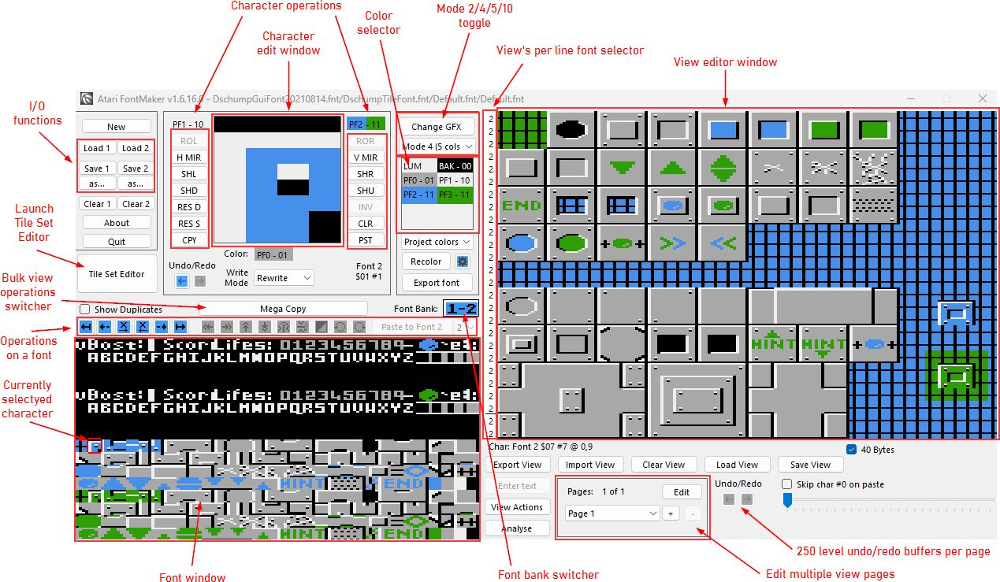
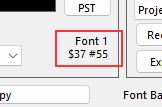
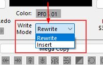
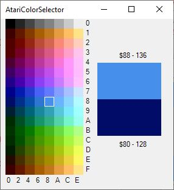
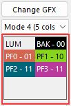
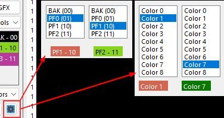
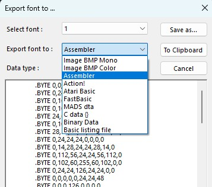
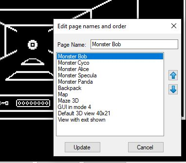
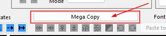
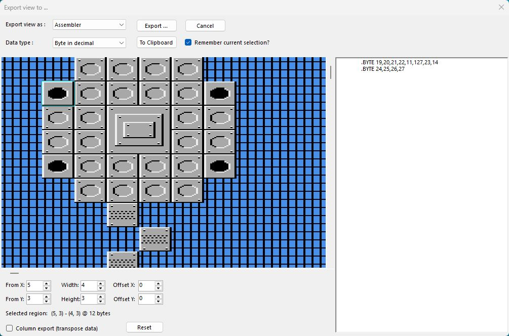

# Atari FontMaker #
#### by matosimi and RetroCoder


## What is it?
Atari FontMaker is a Windows tool used for creating and editing Atari 8-bit/5200 fonts and font-based graphics. The tool was originally written in Delphi but has been ported to C# and its source code repository can be found here: https://github.com/matosimi/atari-fontmaker.
The original Delphi sources are available here: https://sourceforge.net/projects/atari-fontmaker/ and full history of the project is available here: http://matosimi.websupport.sk/atari/atari-fontmaker/.

First version dates back to 2003, since then lot of functionalities were added and lot of refactoring applied, especially in version 1.6 when the code was converted from Delphi to C#.

## Instructions / Features


**I/O Functions** are there to load and safe font files. You can load and edit four fonts at the same time. Filenames are displayed in the window caption. Buttons [Save 1/2/3/4] are there to quickly save the font without a dialog window popping up. Buttons [as...] display a *Save as* dialog.

**Font window** displays two fonts at a time, 32 characters per line. You can switch between the 4 available font slots by clicking the [1-2] or [3-4] button to the right and above the font window. Select a character by clicking on it, the currently selected character is marked by a square cursor and it also displayed in the *Character edit window*. Information about current character is displayed above the *Font window* area:


This displays which font the selected character belongs to, and its Hexadecimal and Decimal representation.

**Character operations** are groups of small buttons on both sides of the character edit window. You can quickly shift, rotate, mirror, invert or clear a character by pressing the appropriate button. Some functions have keyboard shortcuts that are listed in next section, these are also shown as tooltips when you hover the mouse cursor over each button. There are also some additional functional buttons:

- RES D – (restore default) replaces current character with the one from default Atari font
- RES S – (restore last saved) replaces current character with the one that is contained in the most recently saved font file
- CPY – (copy) copy current character to clipboard
- PST – (paste) paste character from clipboard to current selected character

**Change GFX** button switches between hi-res 2-color graphics mode (8×8 pixels per character) and low-res 4/5/9-color graphics mode (4×8 or 2x8 pixels per character). This change is global so all windows that display font characters are affected by this change.

**Character edit window** displays the currently selected character magnified. You can edit character pixels by single clicking on the character window, or you can **click+hold** and move the cursor to continuously draw character pixels.

Tip: You can disable continuous pixel drawing by holding CTRL key while editing.

- Left mouse click – draws foreground color, depending on the draw mode
- Right mouse click – draws background color

There are two draw modes, that can be switched here:


- *Rewrite* (default) inverts pixels that are being clicked on
- *Insert* rewrites pixels that are being clicked on with currently selected color

For color modes, the currently selected color is shown below the character edit window. You can change the current color

- by pressing keys 1,2,3 (mode 4/5), 4,5,6,7,8,0 (mode 10)
- by clicking on one of boxes placed on both sides of the top edge of character edit window
- by holding down the Shift key and using the mouse wheel to change the color


Every change to characters is logged into an undo buffer, so you can undo (and redo) any change you performed by clicking on the appropriate buttons:


Undo buffer size is 2048, so it should be enough to cover complete charset edit.

**Color selector** window contains 6 (or 9) colors that are used in Mode 2 (LUM, BAK), Mode 4/5 (BAK,PF0,PF1,PF2,PF3) or in Mode 10 (9 colors). You can change these colors by clicking on appropriate color and picking new color from Atari color selector:


Tip: You can restore default colors by clicking on color selector window while holding SHIFT key.


**Recolor** feature is useful when you need to swap two colors within a single character. Recolor button has settings button on its side, which displays recolor options:


In the recolor options window you define which color is supposed to be swapped with which other color. The swapping itself it triggered by clicking on the *[Recolor]* button.

Tip: Recolor button can have focus, so its function can be executed by pressing Enter key. In order to quickly recolor multiple characters you can select the first one, click *[Recolor]*, then move to another by pressing the *[.]* key followed by the *[Enter]* key. i.e. . Enter . Enter …and so on. This will recolor consecutive characters quickly.

**Export font** button is useful when you need text representation of the font data as an include to your Basic, Action! or Assembly source, there are several formats to choose from:


The fonts can also be exported as black+white or 5-color bitmaps.

**View window** is basically an area where you can test your fonts and graphics by copying characters from the font window. You can paste characters by left clicking in the view window area. Right click on view window selects the character that has been clicked on.

There are several controls below the view window that allows you to switch between 32 and 40 characters per line, clear view window, load and save view window. There were several view formats used throughout history of Atari FontMaker, all of them can be loaded, but saving is only possible in the latest *.atrview format (or RAW data format).

Tip: Raw (*.dat) format can be saved in 32byte line format or 40byte line format depending on the status of 40 Bytes checkbox.

**Font toggle** column is placed on the left edge of view window and its values defines which font number is used on a particular line of the view window. By default all lines are displayed in font 1, hence all values are set to “1”. You can change values to 2,3 or 4 by left-clicking on the number in font toggle area. Right-clicking on the number cycles through the fonts backwards.

**View Pager** can be used to manage multiple *View windows*. Clicking on the [+] button duplicates the current view and adds a new page. You can use the drop-down list in the pager area to select a page, or use the mouse wheel when hovering over the drop-down list to quickly select a new page.  The [Edit] button allows you to rename the pages and organise the order of them.



Tip: Drawing an animation over a couple of pages and quickly flipping through them is a quick way to check things out.

**Mega Copy mode**
Mega Copy mode has been added in version 1.5, it allows you to copy multiple characters from the font window to the view window and vice versa. It also allows for copy/paste operations in the *view window*.

You can enter Mega Copy mode by clicking on the [Mega Copy] button, the character edit window is switched out for a preview window, and all character editing functions are disabled:


When in **Mega Copy** mode you can click and drag a selection frame in the font or view window to select multiple characters at a time; watch the following video to get idea how it works and what could be achieved:

<iframe width="956" height="538" src="https://www.youtube.com/embed/bSo6yRGIE-Y" title="Atari FontMaker - Mega Copy mode" frameborder="0" allow="accelerometer; autoplay; clipboard-write; encrypted-media; gyroscope; picture-in-picture; web-share" allowfullscreen></iframe>

As you can see it is possible to copy characters to the view window, but it is also possible to copy character data to the font window, so it requires some hands-on experience to fully understand the options available.

Additional function shown in the video is available after clicking on [Enter text] button. You can type free text which will be copied to clipboard, so you can paste it to view (or font) window.

Tip: Keep in mind that multi-character clipboard is working only in Mega Copy mode, you will not be able to paste bigger clipboard contents when you exit the Mega Copy mode.

You can cancel clipboard paste by pressing ESC key or double-clicking the right mouse button.

** Expanded Mega Copy mode **
From version 1.6.7 of the Atari Font Maker there is a new list of font manipulation commands located just above the font selection section.

The first four buttons allow the font characters to be shifted in bulk. You can either rotate all 128 characters left or right, basically shifting the look of each character.  Two buttons allow shifting with hole insertion.  This can be used to create a free spot in a font.

Sometimes you need to manipulate the pixels in a character in such a way that the contents from one spills over into the next character. i.e. You have a nice 2x2 tile but want to center it in a 3x2 tile.  Until now you would have to redraw the pixels into the 3x2 characters.

The expanded Mega Copy mode makes this shifting simpler. By the way, preparing soft-sprites as characters now also becomes easy.

Steps to follow:
- Enter mega copy mode by clicking the [Mega Copy] button
- Select an area in the font or the view window.
  - As an example select the 4x1 area of the word "fox" and the space behind it: "fox ".
  - Note that all characters are unique in this selection
- Pressing CTRL+C or the [CPY] button now copies the characters into a working buffer.
  - The buffer is shown in the location where the character editor window used to be.
  - Above the buffer the buffer preview window you can see the selection size indicator.
- Now the contents of that buffer can be manipulated by the buttons just above the font selection window. The available operations are:
  - Shift left/right
  - Shift up/down
  - Horizontal and Vertical mirror
  - Invert the pixels
  - And if the selected area was square left and right rotation are available.
- Clicking the second button [Shift Copy Area Right] four times should now center the pixels of the "fox " text in the 4 selected characters. It will look like this " fox ".
- The manipulated buffer can now be pasted into any location in the font.
  - Click CTRL+V or the [PST] button to create a paste action.
  - Select the location in the font and press the left mouse button to commit the paste action
  - Press ESC or double click the right mouse button to cancel the paste operation.
  - Lets assume you pasted the shifted " fox " characters to the numbers "0123".
  - Now every occurrence of the number "0123" will show the shifted " fox " text.

One special feature is the ability to paste the copy area back into the selected font characters.
	- If all the characters in the selected area are unique (and come from the same font)
	- then pressing the [Paste in location X] button will paste the working buffer into the original font. i.e. the letters "fox " now become " fox " where the "f" has turned into a " f" and only a portion of the "f" is still in the "f" character, the rest can be found in the "o" character.

**Show Duplicates** Just to the left of the Mega Copy button is the *Show Duplicates* checkbox. Turning it on will cycle through all characters in a font that are identical to (duplicates off) the currently selected character. Very useful to see if you have some duplicates in your character design.

**Export View**
The view window is a useful canvas area where you can test your creations and see if your fonts work out.
You can export the view window data in various formats.  Clicking the *[Export View]* button opens up the following window:


At the top you can select the export format: Binary Data, Assembler, Action!, Atari Basic, FastBasic or MADS dta. Some of these options allow for the data type to be switched between decimal and hex formatting.

The power of the exporter comes from selecting export region.  By default the whole view is selected, Top-left to bottom-right (40x26). By clicking and dragging with the left-mouse button held down you can select an export area. If the export format is text then it will be shown in the right hand side window, which you can copy and paste into your source code, or export to disc with the *[Export...]* button.

**Import View**
The [Import View] button can be used to convert binary data into view data.
The assumption is that you have loaded a font and now would like to view a screen using that font (or multiple fonts).

The process would be to load the data via the [Load Data ...] button.
Set the data width, which would normally be a 32, 40, 48 or some other width set by a custom display list.

Next step is to select the number of bytes to skip and the area of the data to show.
The preview window is updated with each change of a parameter.

Pressing [Import] will transfer the data into the current View.

**Analysis Window**
Once you've designed your characters and combined them into tiles or used them in the view pages you might want to know if there are any unused characters left, or if you have not used one on a view page yet.
This is where the analysis window comes in handy. Click the [Analyse] button to show an all up view of all 4 fonts.  Those characters that have **not** been used in a view page will be marked with a red overlay.
You can change the overlay color and opacity to make sure the highlight does not clash with your color usage.
Moving the mouse over the characters will display some quick usage information. Basically how many of them have been used, both from the base and the inverse parts of the font.
To find out where you have used the character left-click it and a box with more details will show up.  The first line gives information on the character. The subsequent lines list on which pages the character was used.
Clicking the character will also select it in the character editor.
You can click a text line in the details box to quickly jump to the page where the character was used.
Having highlighted a character to get its detailed information you can use the mouse-wheel to move to the previous or next character or hold down the Control key to move by a row at a time.

## Clipboard ##
Since version 1.5 windows clipboard is used by Atari FontMaker. That means you can copy character or set of characters (Mega Copy mode) between multiple instances of Atari FontMaker.

Data is copied to the clipboard as text in JSON format for example:

```json
{"width":"1","height":"1","chars":"12","data":"00A058082490A854"}
```

or

```json
{"width":"2","height":"2","chars":"0B0C2B2C","data":"..."}
```

Width and height are integers, chars and data are hexadecimals.

You can easily store some important clipboard data in text editor for later use.

## fnt format ##

Main output of Atari Font Maker is Atari font file *.fnt. It is a raw binary file, 1024 bytes long without any header. It can be inserted to your project using MADS pseudoinstruction ins, and in order to display it correctly it has to be aligned with any fourth memory page, code example:

```text
          .align $400
myFont    ins 'myFont.fnt'
```

## atrview format ##

Atrview is additional file format that can be created within Atari FontMaker. It is a custom file format that contains contents of view window, data of the four fonts, selected colors and couple more Atari FontMaker settings.

Atrview is not a binary format, it is again JSON (similarly to clipboard data), so it can be read and manipulated (if needed) directly in any text editor.

Note: Upon loading of atrview file, user is prompted if character sets should be loaded from within the file.

**JSON format:**

```json
{
    "Version": "2023",
    "ColoredGfx": "0",
    "Chars": "2",
    "Lines": "26 hex numbers selecting the font nr to display on a line of the view",
    "Colors": "0E0004080C86",
    "Fontname1": "Default.fnt",
    "Fontname2": "Default.fnt",
    "Fontname3": "Default.fnt",
    "Fontname4": "Default.fnt",
    "Data": "128 characters per font in hex",
    "FortyBytes": "1",
    "Pages": [
        {
            "Nr": 3,
            "Name": "Monster Bob",
            "View": "40 x 26 characters in the view",
            "SelectedFont": "26 hex numbers selecting the font nr to display on a line of the view"
        },
        ....
    ]
}
```

## Keyboard controls ##

- **, .** – previous/next character
- **Mousewheel** – previous/next character (left/right)
- CTRL+**Mousewheel** – previous/next character row (up/down)
- **0 1 2 3 4 5 6 7 8** – select color
- **CTRL + 0 - 9 ** – select a page in the view window 1 = 1st page, 9 = 9th page, 0 = 10th page
- **R Shift+R** – rotate character left and right
- **M Shift+M** – mirror horizontal and vertical
- **I** – invert character
- **Ctrl+M** - switch between MegaCopy and normal mode
- **Ctrl+C Ctrl+V** – copy and paste
- **Ctrl+Z Ctrl+Y** – undo and redo font changes
- **Ctrl+Shift+Z Ctrl+Shift+Y** – undo and redo view changes, each page has its own undo/redo buffer
- **Ctrl+Tab** - flip to the next page
- **Ctrl+Shift+Tab** flip to the previous page
- **ESC** - close a dialog or exit from paste mode
- **B** - Switch font bank (1+2) or (3+4)b

## View Actions (new since V1.6.11.0)
Press the [View Actions] button to open a new window.  It contains actions that can be applied to the contents in the View.
At the top you find the page selector. Use this to select the page you want to perform an action on.

### Replace all instances of one character with another
- Select the character in the font area.
- Click the left hand box to set the character to replace
- Select another character in the font area
- Click the right hand box to set the character to replace the one on the left
- Check which font's characters should take part in the replacement
- Press the [Replace in View] button to replace all characters in the view

If you only want to replace the area in a smaller area:
- Hit the [Mega Copy] button to switch into "MegoCopy Mode"
- Select an area
- Press the [Replace in Area] button to replace all characters in the selected area

### Shift View/Area
Press the arrow buttons to move the whole view area in the required direction.
Or select an area and use the area shift buttons on the right to move its contents.

## Changes/History ##
V1.16.15.0
- Added tooltips to the page editor
- Added undo/redo functionality to the view editor
    - CTRL + Shift + Z = Undo
    - CTRL + Shift + Y = Redo
    - Each page maintains its own undo/redo buffer.
- Added out of bounds checks to the various bitmaps. This should prevent the app from crashing when the view area is larger than the screen area.
- Added keyboard shortcuts:
    - CTRL + Tab = Flip to the next page
    - CTRL + Shift + Tab = Flip to the previous page
    - CTRL + M - switch in and out of MegaCopy mode
    - CTRL + 0-9 = select a page in the view window (the first 10 pages can be selected quickly)
    - B - switch between font banks (1+2) or (3+4)
- Added a method to influence cut & paste in the view window.
    When something is pasted into the view window you can now skip all #0 (or the selected) characters.
    This is useful if you have irregular shaped object and you want to paste them over something else.
    All characters or the selected number will be skipped and the pasted object will be placed over the existing characters. 

V1.16.14.4
- Fixed a bug in the view exporter. Small areas would be exported incorrectly.
- Fixed mode 10 color mapping. Inverse colors are mapped correctly now.
- Added a bunch of view actions.
    - You can now clear the whole view or the selected area.
    - You can fill the whole view or the selected area with a character. The character can be selected from the font area.
- Added a binary font exporter. This will export the font data in a binary format. The font data is exported as 1,2 or 4 banks of 128 characters each.
- Added multiple font export options. You can export fonts: 1,2,3,4 ,1+2, 3+4, 1+2+3+4   

V1.16.14.0
- Added Mode 10 (9 colors @ 2x8 pixels)
- Added Mode 5 (double height mode 4)
- Added data import tool
    - Allows the user to load a data file and then specify a line with, X/Y skip and data width and height
    - The loaded data can then be imported into a view
- Switched to .NET 9
    
V1.6.12.1
- Fixed the loading of .fn2 (dual) fonts
- Once loaded the font data will be auto split into "filename-fn2-X.fnt", where X is the font nr.
- RES S button now works with dual fonts.

V1.6.12.0
- Switched to .NET 8, since .NET 7 is no longer supported for couple months.
- Renamed "Paste in location n" to "Paste to Font n" so fit in the button... and better describe what the button does.
- Suppressed warning MSB3825 about BinaryFormatter which is now being obsoleted, but still could be used in .NET 8 winforms.

- V1.6.11.0
- Added a popup with actions that can be applied to the view area
    Replace one character with another in the whole view or a selected area.
     Shift/Move a section or the whole view left/right/up/down

V1.6.10.2
- Added option to transpose exported view data. 
  Normally data is exported by row.  
  When transposed it is exported by column.

V1.6.10.1
- Improved the page name editing dialog.
    Pressing Enter the page name list switches input to the name edit field at the top.
    Pressing Enter in the name edit field will switch to the [Update] button.
- Bug fixes
    - Loading an .atrview file that switches graphics mode could cause a load error
    - When in MegaMode you can enter text to add to the paste buffer. Pressing Shift when pressing [Ok]
      would invert the text and shift it by a font bank. That has been fixed.  SHIFT inverts the characters.
      CONTROL will shift to the 2nd font.

V1.6.10.0
- Clear MegaCopy mode indicator in the bottom right corner

V1.6.9.0
- When working on an inverse version of a character the PF2 (bits 11) color will be drawn in the correct color.
  Either in the base color or PF3 (alternative) color
- The color selection and active color boxes now show the PF2 / PF3 colors as a split background color

V1.6.8.0
- Fixed a bug in the Action! exporter. Thank you to pedromagician for notifying us.
- Added a color change option to the duplicate char indicator.
  Duplicate chars and unused chars can now be highlighted in different colors.

V1.6.7.6
- Lots of memory leak fixes
    Thank you MrFish on AtariAge for noticing that the app sometime uses lots of memory.
- Added a duplicate character finder to the Analysis window
    Click the [Mark Duplicated] check box and all duplicate characters will be linked via a solid line
    This makes it easy to see all duplicate characters in all four fonts.

V1.6.7.5
- View export window enhancements
    - You can now use the mouse-wheel to move your selection box. Up/Down moves in X-direction, CTRL+Up/Down moves in the Y-direction
    - CTRL-C copies the generated export text. Would be same as pressing the [To Clipboard] button.
    - The view export selection values (type and area) are persistet.
- Rotation of pixels in MegaCopy with GFX mode turned on and the width being 2x the height is now possible.

V1.6.7.4
- Added multiple color sets (6 in total).
    You can quickly switch between different color sets via the drop-down.
    The color selections are persisted to disk so survive a reload.
	The first color set uses the values of the currently loaded atrview file (or the defaults), the following 5 sets are free to be used.
- Added a font analysis window. This checks which of the characters are used in the view window pages.
    If you use the view window to test your character combinations then this allows you to quickly find characters that you have not used yet.
    Clicking on a character will give usage details and allow you to quickly switch to the page where the character is used.

V1.6.7.2
- Added delete buttons to the font manipulation area. This will delete the current character and shift all characters from the left or right one spot over.
- Fixed a long standing MegaCopy bug: When not ever having copied something in MegaCopy mode and pasting, from another Atari FontMaker instance, you could paste data past the end of the screen buffer.
- When drawing in the view area you can now hold down the SHIFT key to invert the character you are drawing with.

V1.6.7.1
- Fixed font bank switching when in MegaCopy mode. This used to paste the current copy area on each bank switch.
- Fixed the in-place pasting of the copy area. It did not handle inverted characters correctly.
- Added a preview window when in mega copy mode. This will show the shifted/rotated characters before they are pasted into a font.

V1.6.7.0
- Significant extension to the MegaCopy functionality:
- When an area has been copied the font pixels can now be
    - Shifted left/right/up/down
    - Mirrored horizontally or vertically
    - Inverted
    - If the area is square the pixels can be rotated left or right
    - If the area contains unique characters then the modified font area can be pasted directly into the source characters (into any of the 4 fonts)
- Using the mouse wheel to select the next/prev character has been extended with the control key. When pressing CTRL and using the mouse wheel the character selector will move a row at a time (jump 32 characters).
- This allows for quick left-right and up-down movement in the font selection area.
- The characters in a font can also be shifted left-right with or without creating a hole at the current selected location

V1.6.6.1
- Allow the view exporter to remember its settings.
- Show the X/Y cursor coordinates in the view editor

V1.6.6.0
- Added a view export function
- You can export as binary, or in various text formats
- Select the export region of the current ViewEditor_AddPage_Click
- Fixed a bug when mega copying text from font 3 and 4
- Fixed right-click selection in the view editor, the correct font bank is now selected.
- Double right-click now cancels the paste operation (in both the font selector and the view editor)
- Switching between graphics modes does not redraw the fonts but only copies the new font bank

V1.6.5.0
- Reorganised the code into sections.
- All event handlers are located in FontMakerForm.cs
- AtariFont.cs contains the font data.
- AtariFontRenderer.cs renders the fonts in mono and color.
- All fonts are cached in a bitmap in mono and color, so when switching between there is no need to re-render the fonts.

V1.6.4.0
- Added a second set of fonts.
- The view editor's character set selector (columns of 1 on the left) can now select all 4 fonts.
  - Click on a number to switch to the next font
  - Shift+Click to switch to the previous font
  - Ctrl+Click to reset to font #1

V1.6.0.0 - Switched to C# implementation

V1.5.4.67 – Fixed searching for duplicates of Megacopy exit (wrong behavior causing application hanging), fixed recolor panel refresh

V1.5.3.66 – Added display of character index under mouse cursor in view window; Added DUP checkbox which controls display of duplicate characters in font

V1.5.2.65 – Added new export option: Save as Basic listing *.LST file that can be applied to your existing Basic program by calling ENTER “D:MYFONT.LST”
